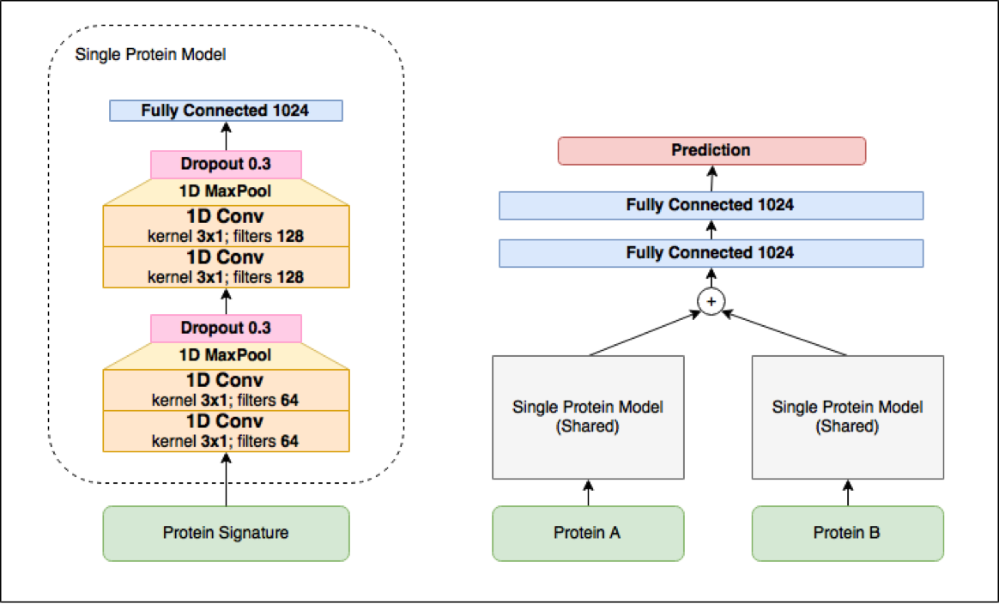

# SigNet: Neural Network Architecture for Predicting Protein-Protein Interactions
-----
SigNet is a Siamese Convolutional Neural Network Architecture for predicting Protein-Protein Interactions. This is work done as part of my Master's Thesis. 



## Initial Setup

### Install Dependancies 

This project was built using Python 2.7.11 and various python libraries. The deep learning aspect is implemented with [Tensorflow](https://www.tensorflow.org/) and [Keras](https://keras.io/). For best practices on installing Tensorflow for your system refer to the guide on the [Tensorflow website](https://www.tensorflow.org/install/).

All of the remaining libraries are in requirements.txt and can be installed using [pip](https://pip.pypa.io/en/stable/installing/):

```
pip install -d requirements.txt
```
Everything was tested on Mac OSX 10.11 (El Capitan), as well as Ubuntu 14.04 and 16.04.

### Download datasets

The 7 datasets used for this work, as well as the protein sequence files, can [downloaded from this link](https://drive.google.com/open?id=0B8wwj9L0MgN-YWFjczIxQjd0ZG8).  Extract all folders and files into the data/ folder.

### Download Results

If you do not wish to run the program and only need the output results, you can download the results [from this link](https://drive.google.com/open?id=0B8wwj9L0MgN-YjBRRnpFRTZtalE). This contains results for SigNet, SPRINT, as well the Combined results for both methods. Extract all 3 folders into the results/ folder. 

## Training and Testing

### Computing Signatures

Before you can run SigNet, the Protein Signatures must be computed for the protein sequence files. Run compute_signatures.py to generate these:

```
python compute_signatures.py
```

Additional, optional, parameters can be specified if you wish to change the type of signatures generated:

```
usage: compute_signatures.py [-h] [-k] [-s]

optional arguments:
  -h, --help           show this help message and exit
  -k , --kmer_length   integer. length of each kmer to consider for signature
                       computation. must be positive and odd. default=3
  -s , --symmetric     bool. define whether ordering of neighbours matters.
                       default=True
```

Alternatively, if you do not wish to generate these yourself, you can download precomputed Signatures from [this link](https://drive.google.com/open?id=0B8wwj9L0MgN-RXgtdU9YS3loX28). Extract the two files into the data/ folder.

### Running Signet

Once all the above requirements have been satisfied, you can run signet.py. Example usage is below:

```
python signet.py --dataset=mint --split=1
```
The above command will train SigNet on split 1 (out of 40) of the MINT dataset, and test on the C1, C2 and C3 test types. The test accuracy and AUROC for all 3 types will be displayed at the end. 

Full usage is below:

```
usage: signet.py [-h] -d  -s  [-v] [-b] [-e]

required arguments:
  -d , --dataset      string. the dataset to use.
  -s , --split        integer. the dataset split to use. value between 1 and
                      41.

optional arguments:
  -v , --val_split    float. proportion of the training samples to use as
                      cross-validation samples. default=0.05
  -b , --batch_size   integer. batch size to use during training. default=128
  -e , --epochs       integer. the number of epochs to train. default=5
```
### Combining Results

To get combined scores for SigNet and SPRINT, use the combine_results.py program. Example usage:

```
python combine_results.py --dataset=biogrid --ctype=1
```

The above command will create a combined model for test type C1 of the Biogrid dataset and test it across all 40 splits. The model, as well as results from the 40 splits, will be saved in the results/Combined/ directory for the appropriate dataset and test type. 

Full usage is below:

```
usage: combine_results.py [-h] -d  -c  [-v] [-b] [-e]

required arguments:
  -d , --dataset      string. the dataset to use.
  -c , --ctype        integer. the test type to use. C1, C2 or C3 (enter value
                      between 1-3)

optional arguments:
  -v , --val_split    float. proportion of the training samples to use as
                      cross-validation samples. default=0.1
  -b , --batch_size   integer. batch size to use during training. default=64
  -e , --epochs       integer. the number of epochs to train. default=50
```

For further inquiries feel free to contact me at [saadem3000@gmail.com](mailto:saadem3000@gmail.com).
